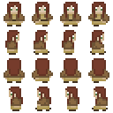

# HTML - GameEngine
### Uma game engine completa baseada em CSS/HTML

---

## O Projeto


HTML-GameEngine é um pequeno projeto inspirado no [Danger Crew](#https://www.youtube.com/watch?v=nHaiLWUaWWw). Meu único propósito é divertir codando hahaha :smile:

## Como Funciona?

O sistema funciona com base em classes e atributos de elementos HTML, tornando a criação de jogos algo bastante intuitivo para programadores frontend;

Exemplo do código de implementação do tutorial:

``` html
<body>
  <!-- Estabelece mapa do jogo -->
  <div id="world" data-source="map00">
    <!-- Implementa o jogador -->
    <div id="player" class="actor" data-home="2;2">
      <div class="animated-spritesheet">
        
      </div>
    </div>
  </div>
</body>
```

## Configurações Básicas

Para especificar algumas propriedades básicas do game, como quadros por segundo (fps) ou controles, você pode editar o arquivo `configs.js` na raiz do projeto

## Implementando Atores

:warning: Em contrução :warning:

### Player

Assim como todos os atores, você pode implementar o player apenas editando os atributos do elemento player:

``` html
<div id="player" class="actor" data-home="2;2">
  <div class="animated-spritesheet">
    
  </div>
</div>
```

Sendo:

> - **data-home** - As coordenadas onde o player iniciará no grid do mapa
> - **data-attributes** - Em breve
> - **data-inventory** - Em breve
> - **data-skills** - Em breve
> - **data-script** - Em breve

Dica:

##### :star: Você pode experimentar os vários exemplos de sprites presentes na pasta `/src/img`, ative o modo debug no `config.js` :star: 

## Contruindo mapas

:warning: Em contrução :warning:

Para criar mapas, basta criar um arquivo `.js` de configuração do mapa dentro de `./assets/maps` e elencá-lo no index em `./assets/index.js`. O arquivo deve seguir o layout a seguir:

``` javascript
export default {
  // Nome de referência do mapa
  name: 'Nome do seu mapa',
  // Nome do arquivo
  tileset: 'tiny-16.png',
  // Tamanho da célula
  cellSize: 16, // in Pixels
  // Mapeamento da textura (precisa ser um quadrado)
  brush: [ // x, y, z-index, type
    [5, 0, 0, 0],[5, 1, 0, 0],
    [5, 1, 0, 1],[5, 1, 0, 0],
  ],
}
```

Sendo:

> - **Name** - O nome do seu mapa
> - **Tileset** - O nome do arquivo que contém as paletas de textura em tileset
> - **cellSize** - O tamanho de cada célula do tileset em pixels
> - **Brush** - Uma lista contendo as informações de cada célula a ser renderizada no mapa

Dica:

##### :star: Para facilitar a edição do mapa, ative o modo debug no `config.js` :star: 

### Implementando o mapa

Após ter criado o seu mapa, para implementá-lo, basta colocar o nome do arquivo (sem a extensão) na propriedade `data-source` do elemento `world` da sua página HTML

``` html
<body>
  <!-- Estabelece mapa do jogo -->
  <div id="world" data-source="{nome-do-arquivo}">
  ...
```

## Eventos

:warning: Em contrução :warning:

## Sistema de Combate

:warning: Em contrução :warning:

## Sistema de Loja

:warning: Em contrução :warning: